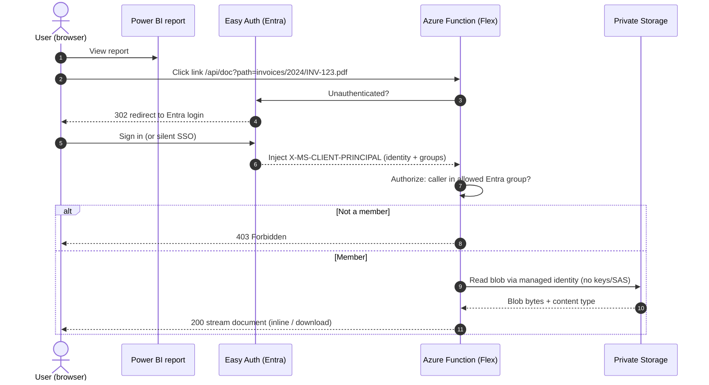
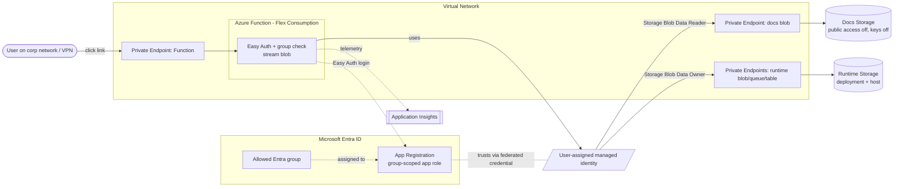

# Document Gateway

A sample that gives authenticated access to documents in a private Azure Storage
Account from a **Power BI** report link. A Python **Azure Function** (Flex
Consumption) sits in front of Blob Storage: it signs the user in with **Entra ID
(Easy Auth)**, checks they are in an allowed **Entra group**, then streams the
document back using a **managed identity**. No storage keys, no client secret,
and no Key Vault — every connection uses Entra ID and managed identity.

> **Disclaimer.** This project is a sample provided **"AS IS"**, without warranty
> of any kind, express or implied. It is **not** an official Microsoft product and
> carries no support or service-level commitment. Review, test, and harden it for
> your own security, compliance, and operational requirements before any
> production use. You assume all risk arising from its use. See [LICENSE](LICENSE).

### Request flow



### Architecture (private networking)



## Layout

| Path | Purpose |
|------|---------|
| `src/functionapp/` | Python 3.12 Function (v2 model) + unit tests |
| `infra/` | Terraform: resource group, user-assigned identity, storage ×2, Flex Consumption Function, Easy Auth (managed identity instead of a secret) + App Registration (federated credential), App Insights, RBAC, private networking |
| `scripts/deploy-code.ps1` | Deploys the function code (remote build); kept separate from infra |

## Prerequisites

**Tooling**

- Terraform ≥ 1.6, Azure CLI (`az login`), and PowerShell 7 (`pwsh`) for the deploy script.

**Azure permissions**

- Rights to create the resources and **role assignments** in the target subscription
  (Owner or Contributor + User Access Administrator).
- Rights in Entra to create an **App Registration** and **assign an app role to a group**
  (e.g. Application Administrator).

**Inputs you must supply**

- The **Entra group object ID** of the users allowed to read documents.
- The **public IP** of the machine running Terraform (`deployer_ip`) — it is allowed
  through the storage firewall to create the container and upload documents.

**Expectations / how it behaves**

- **Region with Flex Consumption + VM-independent quota.** Flex Consumption is used so
  the gateway scales to zero and does not consume regional VM quota.
- **Private by default.** With `enable_private_networking = true`, both storage accounts
  and the Function App are private (public network access locked down, private endpoints).
  Report users therefore reach the gateway **only from the corporate network/VPN**.
- **Deploying from outside the VNet is a two-step access flip.** A machine that is not on
  the VNet (e.g. this one) cannot reach the private Function App. The deploy script can
  briefly open inbound access (`-OpenPublicAccess`) and re-lock it; from a corporate/VPN
  host this is not needed.
- **Code is always built server-side (remote build).** The app's dependencies ship native
  binaries, so a locally built package would not run on the Linux host.
- **First sign-in is interactive.** Easy Auth redirects the browser to Entra; subsequent
  visits single-sign-on silently.

## Deploy

Infrastructure (Terraform) and code (a deploy script) are **decoupled**: infra
and application lifecycles are managed independently, so infra applies don't
re-run on code changes and vice versa.

### 1. Infrastructure (Terraform)

```powershell
cd infra
Copy-Item terraform.tfvars.example terraform.tfvars
# edit terraform.tfvars: subscription_id, allowed_group_object_id, deployer_ip
terraform init
terraform apply
```

Note the outputs — especially `function_app_name` and `doc_endpoint`.

> If the storage container step fails once with a 403, it is RBAC propagation
> lag — re-run `terraform apply`.

### 2. Function code

Code is deployed with a **server-side (remote) build** — the app's dependencies
(`cryptography`/`cffi` via the azure-* SDKs) ship native binaries, so a locally
built package would not run on the Linux host. The script zips the source and
lets Azure build it.

```powershell
./scripts/deploy-code.ps1 -ResourceGroup rg-<name>-<env> -FunctionApp <function_app_name>
```

When the Function App is locked to private inbound access, add
`-OpenPublicAccess` to briefly open it for the deploy and re-lock it afterwards
(run from a host that can reach the app, e.g. the corporate network):

```powershell
./scripts/deploy-code.ps1 -ResourceGroup rg-<name>-<env> -FunctionApp <function_app_name> -OpenPublicAccess
```

### 3. Upload documents

Upload your documents into the `legacy-docs` container using whatever folder
layout you like. The Function serves the blob path the link supplies.

The path is relative to the **fixed container**: a caller can only ever address
blobs inside that one container — the container is pinned in code, so a path
cannot escape it, reach another container, or hit another storage account; an
unknown path is just a `404`. Optionally restrict to specific folders with the
`ALLOWED_PREFIXES` setting (e.g. `invoices/,contracts/`).

### 4. Wire up the Power BI links

#### What `path` means

`path` is the blob's name **within the documents container** (`legacy-docs`) — i.e.
everything after the container in the blob URL, *not* the full URL and *not* the
container name. The gateway pins the container itself.

| Blob in storage | `path` value | Gateway URL |
|---|---|---|
| `legacy-docs/invoices/2024/INV-123.pdf` | `invoices/2024/INV-123.pdf` | `https://<host>/api/doc?path=invoices/2024/INV-123.pdf` |
| `legacy-docs/contracts/NGTL-12.pdf` | `contracts/NGTL-12.pdf` | `https://<host>/api/doc?path=contracts/NGTL-12.pdf` |
| `legacy-docs/hello.txt` | `hello.txt` | `https://<host>/api/doc?path=hello.txt` |

A concrete example (`<function-host>` is your Function App's default hostname):

```
https://<function-host>.azurewebsites.net/api/doc?path=samples/hello.txt
```

#### Transforming an existing blob URL into a gateway URL

If your dataset already holds full blob URLs, strip the
`https://<account>.blob.core.windows.net/<container>/` prefix to get `path`, then
prepend the gateway endpoint. For example:

```
from:  https://mydocsaccount.blob.core.windows.net/legacy-docs/invoices/2024/INV-123.pdf
                                                    └────────────── path ──────────────┘
to:    https://<function-host>.azurewebsites.net/api/doc?path=invoices/2024/INV-123.pdf
```

Power Query (M) — transform a `BlobUrl` column into a gateway link column:

```m
= Table.AddColumn(Source, "DocLink", each
    let
      // drop everything up to and including "/legacy-docs/"
      path = Text.AfterDelimiter([BlobUrl], "/legacy-docs/")
    in
      "https://<function_app_hostname>/api/doc?path=" & Uri.EscapeDataString(path))
```

If instead you store just the relative path (recommended), use it directly:

```m
= Table.AddColumn(Source, "DocLink", each
    "https://<function_app_hostname>/api/doc?path=" & Uri.EscapeDataString([BlobPath]))
```

or DAX:

```DAX
DocLink = "https://<function_app_hostname>/api/doc?path=" & [BlobPath]
```

Set the column's **Data category = Web URL** so Power BI renders it as a clickable
link. Add `&download=1` to force a download instead of opening inline in the browser.

## Bring your own infrastructure (existing Function App / storage / VNet)

If the Function App, storage account, and VNet already exist (provisioned by your
platform team), skip Terraform and wire the gateway onto the existing resources.
You configure four things: the **managed identity + RBAC**, the **app settings**,
the **Easy Auth provider**, and the **code**.

Set these once:

```powershell
$rg      = "<resource-group>"
$func    = "<function-app-name>"
$docsSa  = "<docs-storage-account>"
$groupId = "<entra-group-object-id>"   # users allowed to read documents
$tenant  = az account show --query tenantId -o tsv
```

### 1. Identity + storage RBAC

The Function needs a managed identity that can read the documents container.
Either reuse the app's existing user-assigned identity or create one and assign it.

```powershell
# Identity client ID assigned to the Function App (user-assigned identity).
$uamiClientId   = "<uami-client-id>"
$uamiPrincipal  = "<uami-principal-id>"

# Allow the identity to read blobs in the docs account.
$docsId = az storage account show -n $docsSa -g $rg --query id -o tsv
az role assignment create --assignee-object-id $uamiPrincipal `
  --assignee-principal-type ServicePrincipal `
  --role "Storage Blob Data Reader" --scope $docsId
```

### 2. App settings

```powershell
az functionapp config appsettings set -n $func -g $rg --settings `
  DOCS_STORAGE_ACCOUNT=$docsSa `
  DOCS_CONTAINER=legacy-docs `
  ALLOWED_GROUP_IDS=$groupId `
  ALLOWED_PREFIXES="" `
  MAX_DOWNLOAD_BYTES=104857600 `
  MAX_PATH_LENGTH=1024 `
  AZURE_CLIENT_ID=$uamiClientId        # which identity DefaultAzureCredential uses
```

> `AZURE_CLIENT_ID` is **required** with a user-assigned identity — it tells the SDK
> which identity to use when reading the docs storage.

### 3. App Registration + Easy Auth

Create (or reuse) an Entra app registration for sign-in, restrict it to the group,
and turn on Easy Auth.

```powershell
$host = az functionapp show -n $func -g $rg --query defaultHostName -o tsv
$reply = "https://$host/.auth/login/aad/callback"

# App registration (single-tenant) with a group-scoped app role.
$appId = az ad app create --display-name "$func-auth" `
  --sign-in-audience AzureADMyOrg `
  --web-redirect-uris $reply `
  --query appId -o tsv

# Emit only app-assigned groups (overage-safe), then create a service principal,
# require assignment, and assign the group. (Use the portal or Microsoft Graph to
# add the groupMembershipClaims=ApplicationGroup setting and the app role, then:)
az ad sp create --id $appId
# az ad app-role + group assignment via Graph / portal …
```

Configure the client secret (or, for a secretless setup, a federated credential on
the app trusting the managed identity — see *Security properties* below). Then
enable Easy Auth:

```powershell
az webapp auth update -n $func -g $rg `
  --enabled true `
  --action RedirectToLoginPage `
  --redirect-provider azureactivedirectory `
  --aad-client-id $appId `
  --aad-token-issuer-url "https://login.microsoftonline.com/$tenant/v2.0"
```

### 4. Deploy the code

```powershell
./scripts/deploy-code.ps1 -ResourceGroup $rg -FunctionApp $func -OpenPublicAccess
```

### 5. Upload documents and wire up Power BI

Same as steps 3–4 above — upload into the `legacy-docs` container and point the
report's Web URL column at `https://<host>/api/doc?path=<blob path>`.

> The Terraform in `infra/` does all of the above automatically; this section is
> only for grafting the gateway onto pre-existing infrastructure.

## Configuration (app settings)

| Setting | Meaning |
|---------|---------|
| `DOCS_STORAGE_ACCOUNT` | Private storage account name |
| `DOCS_CONTAINER` | Container with the documents (default `legacy-docs`) |
| `ALLOWED_GROUP_IDS` | Comma-separated Entra group object IDs allowed to read |
| `ALLOWED_PREFIXES` | Optional comma-separated path prefixes to allow (empty = whole container) |
| `MAX_DOWNLOAD_BYTES` | Size cap streamed through the gateway (default 100 MiB) |
| `MAX_PATH_LENGTH` | Maximum blob path length accepted (default 1024) |
| `AZURE_CLIENT_ID` | Client ID of the user-assigned managed identity. **Required** so `DefaultAzureCredential` uses the right identity when reading the docs storage. |

## Security properties

- **No keys or secrets.** A single **user-assigned managed identity** is used for
  every connection — no storage account keys, no client secret, no Key Vault.
- Storage Account: **public access disabled**, **shared keys disabled** — only
  Entra/RBAC. The Function reads documents with the managed identity
  (`Storage Blob Data Reader`). No SAS, no keys, no secrets in the report.
- Easy Auth requires a valid Entra sign-in; the app role assignment means only
  the configured group can sign in. Code additionally validates the group claim
  (`ApplicationGroup`, overage-safe).
- **Easy Auth uses a managed identity instead of a secret:** the app registration
  trusts the managed identity via a **federated identity credential** (used as a
  client assertion) instead of a client secret — nothing to store or rotate.
- The container is **pinned server-side** and the path is sanitized (no
  backslashes, leading slashes, `.`/`..` segments, control chars, or URLs), so a
  caller cannot escape the container. `ALLOWED_PREFIXES` can narrow it further.

## Notes

- Documents above `MAX_DOWNLOAD_BYTES` return `413` rather than timing out.
- Per-user access is logged to App Insights (`doc_served path=… user=<oid>`).

## Tests

```powershell
cd src/functionapp
python -m venv .venv
.\.venv\Scripts\python.exe -m pip install pytest azure-identity azure-storage-blob
.\.venv\Scripts\python.exe -m pytest -q
```
